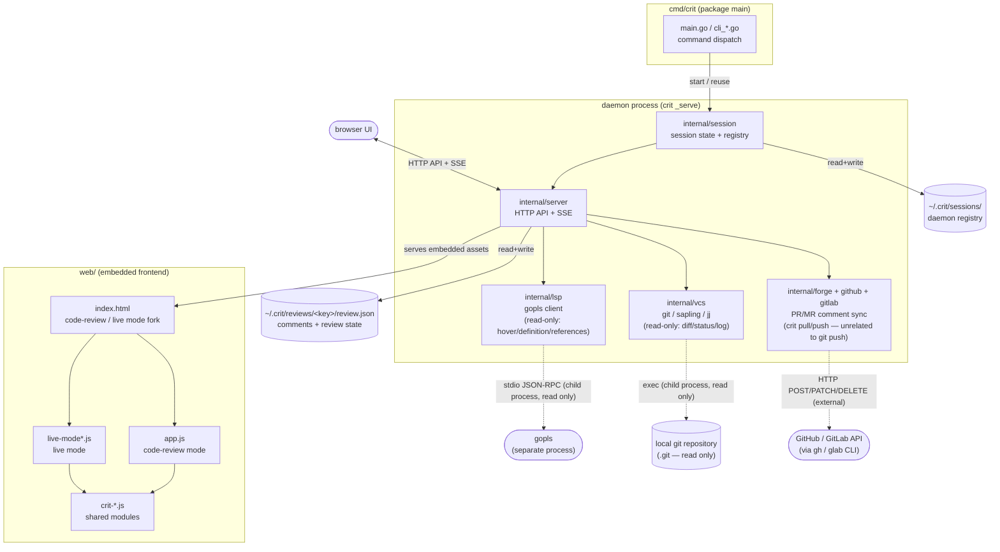
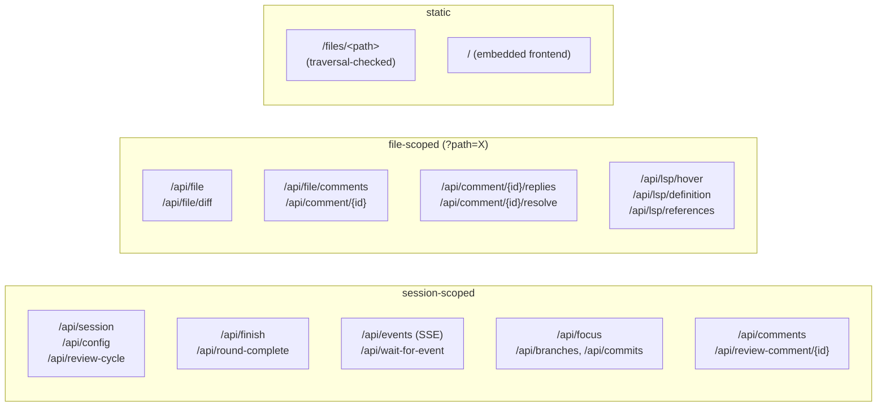
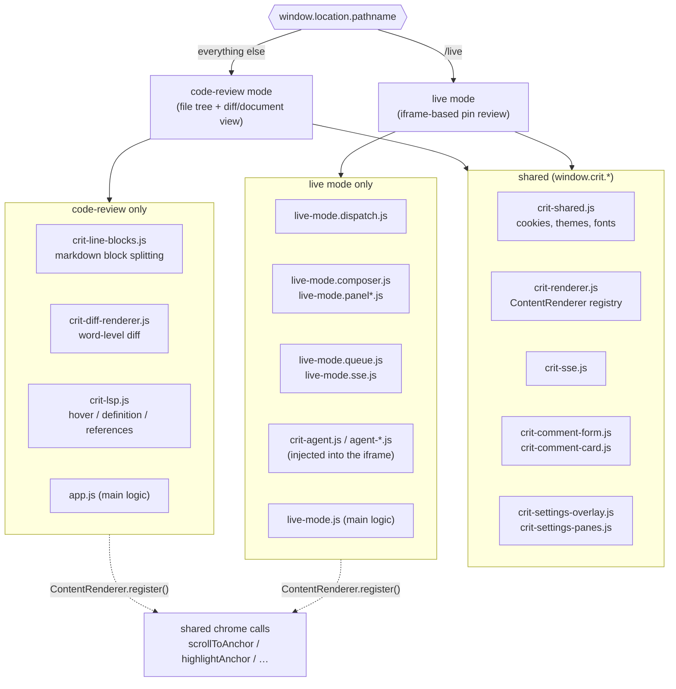
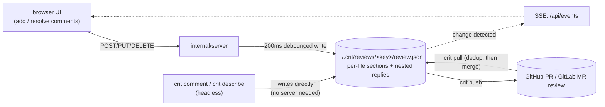

# Crit architecture

Crit is a single-binary Go CLI that opens a browser UI for reviewing code, plans,
and running web apps with GitHub-PR-style inline comments. The whole frontend is
embedded in the binary via `embed.FS` — vanilla JS, no build step, no bundler.

This document is the map. For task-scoped rules (how to add a config key, a CLI
subcommand, an HTTP route) see [`AGENTS.md`](AGENTS.md).

## 1. System overview



Legend: cylinders `[( )]` are real storage — `~/.crit/` is crit's own data,
`.git` is someone else's that crit only reads. Rounded `( )` are separate
processes or remote services. Dashed `-.->` means "spawns a child process" or
"makes an external HTTP call"; solid arrows are in-process calls and writes to
crit's own data.

What each integration actually does:

- **`internal/vcs` → local git**: read-only shell-outs (`diff`, `status`, `log`,
  `show`, `rev-parse`). Never `commit`, `add`, `checkout`, `push`, or `reset`.
  The sapling and jj backends are read-only too.
- **`internal/lsp` → gopls**: JSON-RPC over stdio, but only `initialize`,
  `textDocument/hover`, `textDocument/definition`, `textDocument/references`,
  and `shutdown`. No `workspace/applyEdit` — it never modifies files.
- **`internal/forge` → GitHub / GitLab**: `crit pull` fetches PR/MR review
  comments; `crit push` posts a review, replies, edits, and deletes. Nothing to
  do with `git push` — no code leaves your machine.

Crit makes no other outbound requests except a single version check on startup
(`CRIT_NO_UPDATE_CHECK=1` disables it).

## 2. Daemon and session lifecycle

`crit` does not start a fresh process per invocation. It derives a key from
cwd + args (+ branch in git mode) and reuses a background daemon.

```mermaid
sequenceDiagram
    participant User
    participant CLI as crit (client)
    participant Daemon as crit _serve
    participant Registry as ~/.crit/sessions/
    participant Review as ~/.crit/reviews/&lt;key&gt;/

    User->>CLI: crit
    CLI->>Registry: look up session (hash of cwd + branch/args)
    alt no live session
        CLI->>Daemon: spawn crit _serve
        Daemon->>Daemon: bind HTTP port, signal ready over a pipe
        Daemon-->>CLI: ready (session init continues in background)
        CLI->>Daemon: poll GET /api/session until it stops 503-ing
    else session alive
        CLI->>Daemon: signal round-complete
    end
    Daemon->>Review: read/write review file (200ms debounce)
    Daemon-->>User: open browser, push SSE updates
    User->>Daemon: comment / Approve in the browser
    Daemon-->>CLI: /api/wait-for-event unblocks
```

- **Lazy init + readiness gate**: every endpoint except `/api/health` returns
  503 until `SetSession()` finishes. Any client must poll `/api/session` before
  calling anything else — skipping that poll is the classic source of races
  where an error-fallback path silently approves.
- **No idle timeout**: the daemon lives until Ctrl+C, `crit stop`, or a signal.
  Walking away mid-review is fine.
- **LSP is the exception**: gopls starts on the first LSP request and shuts down
  after 3 minutes idle (`defaultIdleTimeout`), plus on daemon exit.

## 3. HTTP API shape (`internal/server`)



- State-changing requests (POST/PUT/PATCH/DELETE) reject
  `Sec-Fetch-Site: cross-site` — CSRF defense for a loopback server. A missing
  header is allowed so CLI and agent callers work.
- Binding anywhere but `127.0.0.1`, or setting `public_url`, requires
  `--allow-unauthenticated-network`. Crit has no network authentication.
- Path validation for `/files/` and for session disk reads goes through
  `internal/pathsafe.ResolveUnder`, which resolves symlinks and requires the
  result to sit strictly inside the repo root.

## 4. Frontend: the two-paradigm page fork

`index.html` is one HTML shell. A script block reads `window.location.pathname`
at load time and pulls in one of two module sets.



- Each mode registers a `ContentRenderer` (`scrollToAnchor`, `highlightAnchor`,
  `getMode`, …) so shared chrome — comment cards, the settings overlay — can
  drive the view without knowing which mode is active.
- Every module is an IIFE with dual export (`window.crit.<namespace>` at runtime,
  `module.exports` for Node tests). No ES modules: there is no build step.
- Appearance is CSS custom properties only. `theme.css` holds the built-in
  dark/light palettes plus the community palettes; adding one is a single
  `[data-theme="…"]` block — see [`THEMES.md`](THEMES.md).

## 5. LSP integration (`internal/lsp` → gopls)

```mermaid
sequenceDiagram
    participant UI as crit-lsp.js
    participant API as /api/lsp/*
    participant Mgr as internal/lsp.Manager
    participant Gopls as gopls

    UI->>API: hover (path, line, char) after 350ms dwell
    API->>API: lspAvailable? (config + gopls on PATH + repo root)
    API->>Mgr: Hover(absPath, line, char)
    alt no client yet
        Mgr->>Gopls: spawn + initialize
    end
    Mgr->>Gopls: didOpen / didChange if the file hash moved
    Mgr->>Gopls: textDocument/hover
    Gopls-->>Mgr: markdown contents
    Mgr-->>API: contents
    API-->>UI: JSON
    Note over Mgr,Gopls: idle 3min → shutdown; daemon exit → kill
```

- **Availability is triple-gated**: the `lsp` config key (default true), `gopls`
  on `PATH`, and a session with a repo root. `/api/config` exposes the result as
  `lsp_available`; the frontend does not even load its listeners without it.
- **The client-side breaker** trips after 3 consecutive failures and half-opens
  30s later, so a slow gopls warm-up on a big module doesn't permanently
  disable the feature.
- **Requests are read-only.** `internal/lsp` never sends an edit-producing
  method, so a language server cannot modify the tree under review.
- Definition results are classified against repo root / `GOROOT` / `GOMODCACHE`.
  In-session targets jump inline (expanding a collapsed diff gap if needed);
  everything else opens the peek popup.

## 6. Comment and review-file persistence



- The review file is keyed by cwd + branch (git mode) or cwd + args (file mode).
- Headless writers (`crit comment`, `crit describe`) write the file directly; a
  running daemon notices the mtime change, merges, and pushes an SSE event, so
  an open tab updates without a reload.
- Anything importing comments from outside **must** dedup against local state
  first (`buildLocalIDSet` + `buildLocalFingerprintIndex` +
  `dropDuplicateWebComment`) or repeated pulls duplicate comments.

## 7. Key design decisions

| # | Decision | Why |
|---|---|---|
| 1 | Frontend embedded via `embed.FS` | one real single binary |
| 2 | No build step (vanilla JS) | npm only fetches vendor libs |
| 3 | Two modes: git and files | branch diffs and arbitrary files both work |
| 4 | markdown-it for parsing | `token.map` gives per-block source lines |
| 5 | Block-level splitting | lists, fences, tables, quotes commentable per line |
| 6 | Diff hunks with dual gutters | old and new line numbers side by side |
| 7 | Comments reference source lines, stored as JSON | `~/.crit/reviews/<key>/review.json` |
| 8 | Write the review file on every change | 200ms debounce keeps agents in sync |
| 9 | Poll-based file watching | `git status --porcelain` or mtimes → SSE |
| 10 | Localhost by default | non-loopback needs an explicit flag; there is no auth |
| 11 | Two-level config + CLI flags | `agent_cmd` / `plan_approve_mode` are global-only so a repo cannot hijack them |
| 12 | Headless `crit comment` | agents annotate without a browser |
| 13 | Threaded comments with `resolved` | replies nest inside the parent |
| 14 | VCS abstraction | git, sapling, jj behind one read-only interface |
| 15 | Forge abstraction | GitHub and GitLab behind `internal/forge` |
| 16 | Focus mode (file / range / stacked) | supports stacked-PR review |
| 17 | LSP integration for Go | lazy start, 3-minute idle shutdown, one manager per daemon |

## 8. Directory map

```
crit/
├── cmd/crit/            # package main — thin CLI (main.go, cli_*.go, wire.go)
├── internal/            # core logic (daemon, server, session, forge, github,
│                        #   gitlab, vcs, lsp, pathsafe, story, …)
├── web/                 # embedded frontend assets (package webassets; embed.go)
├── integrations/        # drop-in configs for AI coding tools
├── test/                # harnesses, Playwright E2E, roundtrip docs, fixtures
├── Makefile
├── package.json
└── copy-deps.js         # copies npm deps into web/ for embedding
```
